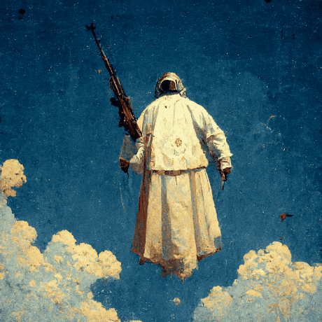

**Fun facts about me!**
- I enjoy keyboard and PC building
- I play the baritone saxophone!

**Current Interests:**
- Game development (SDL)
- Neural networks
- Programming language theory/development
- Forths (LIFO)
- Garbage Collectors
 

**Languages I am studying:** C, C++, Assembly (nasm/fasm), Python, Rust, HTML, CSS, Javascript, Lua, Make, Vimscript, Shell, Forth
